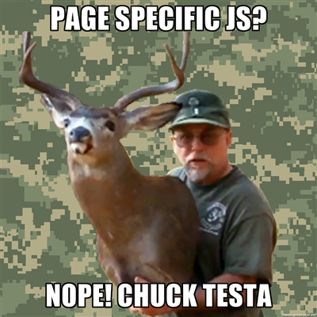

!SLIDE

## Loading the proper javascript for a specific page ##

# Page specific Javascript #

### Rafa Cardoso ###

!SLIDE

## github.com/rafamvc ##
## r@rafa.ca ##
## @idontusetwetter ##

!SLIDE commandline incremental

## Lets create some app that needs page specific javascript ##

	$ rails new CoolProject

	$ rails generate scaffold client name:string address:string

	$ rails generate scaffold product name:string price:integer

!SLIDE center transition=turnUp

!SLIDE center transition=turnUp

<!-- Part 1 -->

!SLIDE small

## product.js: ##
	@@@ javascript
	
	COOLPROJECT.product = {
	  init: function() {
	    alert('product page js only'); 
	  }
	}

## application.html.erb: ##

	@@@ HTML
	<html>
	<body data-controller="<%=controller_name%>" >
	</body>
	</html>

!SLIDE smaller

## So, how do we load that javascript? ##
### Create a init.js, and put it into the asset pipeline ###

	@@@ javascript
	COOLPROJECT = {
	};

	UTIL = {
	  exec: function( controller ) {
	    var ns = COOLPROJECT;

	    if (controller !== "" && ns[controller] //breaklinemagic
	    		&& typeof ns[controller]['init'] == "function" ) {
	      ns[controller]['init']();
	    }
	  },

	  init: function() {
	    var body = document.body,
	        controller = body.getAttribute( "data-controller" );
	    UTIL.exec( controller );
	  }
	};
	$( document ).ready( UTIL.init );

<!-- Part 2 -->

!SLIDE small

## product.js: ##
	@@@ javascript
	
	COOLPROJECT.products = {
	  init: function() {
    	alert('every product page');
	  },
	  index: function() {
	    alert('only at index');
	  },
	  edit: function() {
	    alert('only at edit');
	  }
	}

## application.html.erb: ##

	@@@ HTML
	<html>
	<body 	data-controller="<%=controller_name%>" 
			data-action="<%=action_name%>">
	</body>
	</html>

!SLIDE smaller

## So, how do we load that javascript per action? ##
### Simple! Copy and paste this code! ###

	@@@ javascript
	COOLPROJECT = {
	};
	UTIL = {
	  exec: function( controller, action ) {
	    var ns = COOLPROJECT,
	        action = ( action === undefined ) ? "init" : action;

	    if ( controller !== "" && ns[controller] //breaklinemagic
	    		&& typeof ns[controller][action] == "function" ) {
	      ns[controller][action]();
	    }
	  },

	  init: function() {
	    var body = document.body,
	        controller = body.getAttribute( "data-controller" ),
	        action = body.getAttribute( "data-action" );

	    UTIL.exec( controller );
	    UTIL.exec( controller, action );
	  }
	};

	$( document ).ready( UTIL.init );

!SLIDE center transition=turnUp

I didn't create it:

Paul Irish did, and Jason Garber extended it.

[http://viget.com/inspire/extending-paul-irishs-comprehensive-dom-ready-execution](http://viget.com/inspire/extending-paul-irishs-comprehensive-dom-ready-execution)

It is also known as DOM-based Routing.

!SLIDE center transition=turnUp

## Well, while we are at it, ##
# what about the CSS per action/controller? #

!SLIDE small transition=turnUp

application.html.erb

	@@@ HTML
	<html>
	<body 	data-controller="<%=controller_name%>" 
			data-action="<%=action_name%>"
			class="<%=controller_name%>">
	</body>
	</html>

projects.scss

	@@@ css
		.projects {
			input { 
				color: red;
			}
		}

### I got this idea from Ben Hughes. Thanks Ben! ###

!SLIDE transition=turnUp

# Q & A #

## Is that useful? Should I make it a gem? ##

	@@@ ruby
	source 'https://rubygems.org'

	gem 'rails', '3.2.2'
	gem 'init.js'

!SLIDE center transition=turnUp

# Bootstrap with rails #

!SLIDE transition=turnUp

# The easy way #
  
  Add bootstrap-generators to your gem

	@@@ ruby
	source 'https://rubygems.org'

	gem 'rails', '3.2.2'
	gem 'simple_form', '~> 2.0'
	gem 'bootstrap-generators'

	$ rails generate bootstrap:install 
		--form_builder=simple_form

!SLIDE transition=turnUp

# The other easy way #

Download bootstrap.zip and install it manually.

!SLIDE transition=turnUp

# Q & A #
